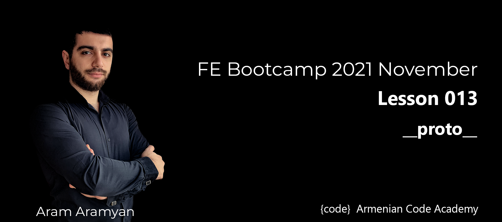
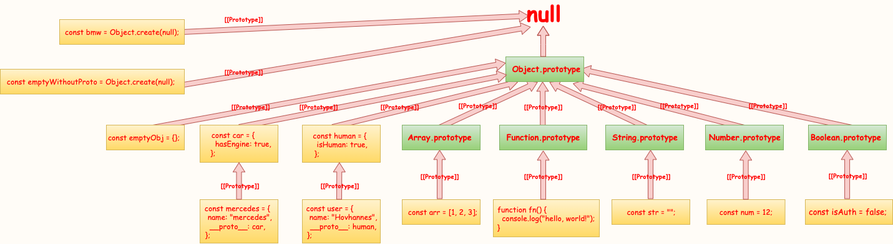

---
# proto


#### ***Write Pagination object that will get an array and pageSize, then will return the following.***
  * prevPage
  * nextPage
  * firstPage
  * lastPage
  * goToPage
  * getPageItems

```javascript
const alphabetArray = "abcdefghijklmnopqrstuvwxyz".split("");
Pagination.init(alphabetArray, 4);

Pagination.getPageItems(); // ["a", "b", "c", "d"]
Pagination.nextPage(); // add the current page by one
Pagination.getPageItems(); // ["e", "f", "g", "h"]
Pagination.nextPage().nextPage(); // the ability to call chainable
Pagination.goToPage(3); // current page must be set to 3
```

[**SOLUTION**](1.pagination.js)
___

#### ***Airplane TASK:***
* Write an Airplane object that initializes name.
* Give airplanes the ability to .takeOff() and .land():
  * If a plane takes off, its isFlying property is set to true.
  * If a plane lands, its isFlying property is set to false.

[**SOLUTION**](2.airplane.js)
___

#### ***Create a draw for following code:***

```js
const arr = [1, 2, 3];

const human = {
  isHuman: true,
};

const str = "";

const user = {
    name: "Hovhannes",
    __proto__: human,
};

const car = {
  hasEngine: true,
};

const mercedes = {
    name: "mercedes",
    __proto__: car,
};

const bmw = Object.create(null);

const emptyObj = {};

function fn() {
    console.log("hello, world!");
}

const emptyWithoutProto = Object.create(null);

const num = 12;

const isAuth = false;
```
#### ***DIAGRAM***
